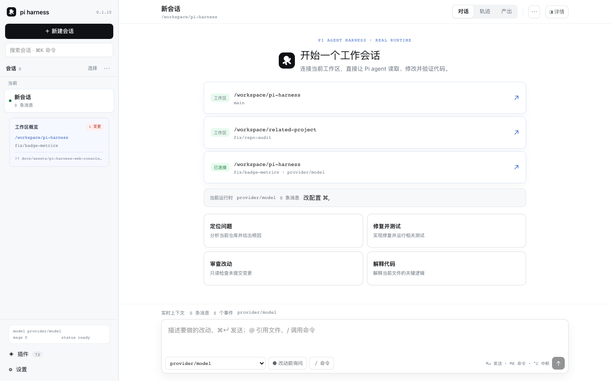

# Pi Harness

[](https://github.com/pi-harness/pi-harness/actions/workflows/ci.yml)
[](https://www.npmjs.com/package/@pi-harness/pi-harness)
[](https://www.npmjs.com/package/@pi-harness/pi-harness)
[](https://github.com/pi-harness/pi-harness/stargazers)
[](LICENSE)

Pi Harness is a plugin-first web host and CLI for [Pi](https://github.com/earendil-works/pi), built on [DeepSeek Cordis](https://github.com/DeepAgentsLab/cordis). It provides a local browser console, HTTP API, stdio workflows, and a composable plugin runtime.

> Languages: [简体中文](docs/README.zh-CN.md) · [日本語](docs/README.ja.md) · [한국어](docs/README.ko.md) · [Español](docs/README.es.md) · [Français](docs/README.fr.md) · [Deutsch](docs/README.de.md) · [Português (Brasil)](docs/README.pt-BR.md) · [Русский](docs/README.ru.md) · [Italiano](docs/README.it.md) · [العربية](docs/README.ar.md)

## Quick start

Requirements: Node.js 22.19+ and npm 10+.

```sh
npm install --global @pi-harness/pi-harness
pi-harness
```

The web console listens on `http://127.0.0.1:3141` by default. It boots with `everyapi/deepseek-v4-flash` and model selection is fail-closed, so the provider must be registered in `PI_AGENT_DIR` first: provision it with `everyapi use pi-harness`, or set `PI_HARNESS_PROVIDER` and `PI_HARNESS_MODEL` to a model that agent directory already knows. For a terminal workflow:

```sh
pih "Summarize the current directory"
```

To run from source:

```sh
npm ci
npm run build
npm run web
```

## Web console



## What you get

- A Cordis plugin tree for models, resources, sessions, tools, runtime, Web/API, and stdio.
- A project-owned YAML profile system for enabling, configuring, grouping, and composing plugins.
- A separately published `@pi-harness/core` package, so compatible built-in plugin fixes can ship without republishing the launcher, and a `@pi-harness/plugin-api` package carrying only the contract a plugin is written against.
- A non-blocking update check that suggests a compatible core update. Run `npm update --global @pi-harness/pi-harness`; set `PI_HARNESS_DISABLE_UPDATE_CHECK=1` to disable checks.
- Safe defaults: loopback-only web hosting, explicit project trust for executable resources, bounded operations, cancellation, and lifecycle rollback. The unauthenticated API also rejects requests whose `Host` header does not name the bound address and port and cross-site requests whose `Origin` does not match it, which blocks CSRF and DNS rebinding; a reverse proxy must forward the original `Host` header over plain HTTP.

## CLI and profiles

```sh
pih --profile default "Summarize the current directory"
pih --profile development "Summarize the current directory"
pih --config ./cordis.yml "Summarize the current directory"
pih --profile default --dump-config
```

Profiles are Cordis Loader entry arrays. Each entry has a unique `id` and module `name`, plus optional `config`, `inject`, `group`, or `disabled` fields. See the [profile guide](docs/README.reference.md#profiles) and [plugin catalog](docs/README.reference.md#selected-core-production-plugins).

Common environment variables:

| Variable                          | Purpose                                             | Default             |
| --------------------------------- | --------------------------------------------------- | ------------------- |
| `PI_HARNESS_HOST`                 | Web bind host                                       | `127.0.0.1`         |
| `PI_HARNESS_PORT`                 | Web bind port                                       | `3141`              |
| `PI_AGENT_DIR`                    | Pi state and credentials directory                  | `~/.pi/agent`       |
| `PI_HARNESS_PROVIDER`             | Web console model provider                          | `everyapi`          |
| `PI_HARNESS_MODEL`                | Web console model id                                | `deepseek-v4-flash` |
| `PI_HARNESS_ALLOW_REMOTE`         | Allow a non-loopback host when set to `1`           | unset               |
| `PI_HARNESS_ALLOWED_HOSTS`        | Extra `Host` header names accepted, comma-separated | unset               |
| `PI_HARNESS_DISABLE_UPDATE_CHECK` | Disable the background update check when set to `1` | unset               |

The web server answers only requests whose `Host` header names loopback, the configured bind host, or (on a wildcard bind such as `0.0.0.0`) one of this machine's own addresses or its hostname; anything else is rejected as a DNS-rebinding attempt. `PI_HARNESS_ALLOWED_HOSTS` adds names the machine does not know about itself, such as a LAN alias or a reverse proxy.

## Architecture

```text
CLI / web launcher
└── Cordis Context
    ├── Loader + Include(profile YAML)
    ├── models → resources → model → session → tools → runtime
    ├── webserver → API routes → browser console
    └── stdio application
```

`@pi-harness/core` is an independent npm package containing multiple Cordis plugins; it is not a single plugin. External plugins can be installed in a project and referenced from its profile.

## Author a plugin

A plugin is an ordinary Cordis plugin written against [`@pi-harness/plugin-api`](packages/plugin-api), which carries the harness service types, config helpers and bounded workspace access without the launcher. Use the [plugin authoring guide](docs/README.reference.md#author-a-plugin) and the working [hello-plugin example](examples/plugin-hello). Treat profiles, plugin packages, and trusted project resources as executable code.

## Development

```sh
npm test
npm run typecheck
npm run lint
npm run build
npm run test:package
```

CI runs these on Node 22, and `.tool-versions` pins the same major for anyone using asdf or mise. The package only requires Node 22.19+, so a newer runtime works — but built-in modules do change behaviour between majors, and a test that passes locally on Node 24 can still fail in CI.

The reference documents the selected plugin catalog, every HTTP API route, configuration rules, resource limits, failure modes, and security boundaries: [README.reference.md](docs/README.reference.md). Core ships more plugins than the catalog describes; [`packages/plugins`](packages/plugins) is the complete set, and every one of them is installed from the plugin center like a community plugin. A fresh install enables infrastructure only, which is what [`apps/web/profile/cordis.yml`](apps/web/profile/cordis.yml) contains.

## Star history

[](https://www.star-history.com/#pi-harness/pi-harness&Date)

## License

MIT. See [LICENSE](LICENSE).
